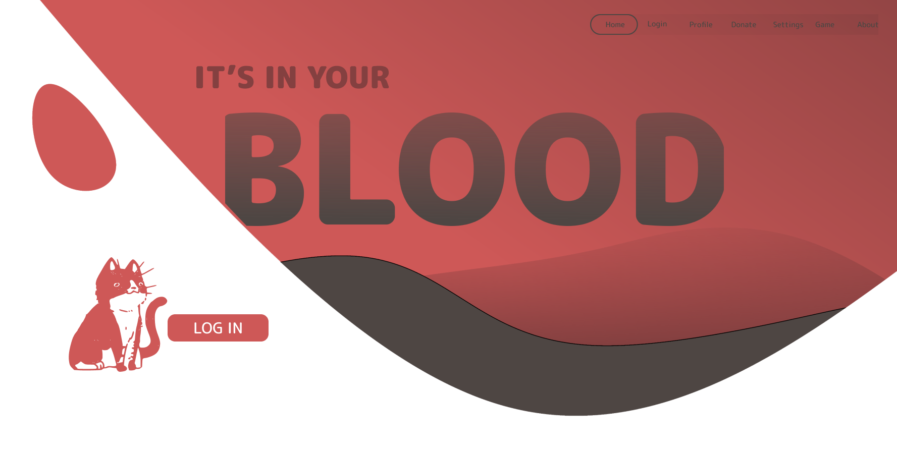

# BloodDonors
<h6>By <a href="https://github.com/dyuan2001">Daniel Yuan</a>, <a href="https://github.com/flextian">Alex Tian</a>, <a href="https://github.com/torpdeo">Aaron Pan</a>, <a href="https://github.com/jyuan1999">Jennifer Yuan</a></h6>

As the pandemic raged, one of the side effects was an urgent shortage of blood donations throughout the world. As only 38% of the population is eligible to donate, it is imperative that we find a way to incentivize donors to continue to donate consistently and frequently to save the most lives. We decided to gamify the process and create a full stack web application to serve the needs of both donors and providers!

    
    

## Table of Contents
  * [Overview](#overview)
  * [Installation](#installation)
  * [Sources](#sources)

## Overview
The app is built using Django REST Framework for the API backend and React for the frontend. Users are able to create appointments and view upcoming appointments, earned badges, and donation statistics in their profiles. All users can also view a leaderboard of top users sorted by total donations. A list of all upcoming donations for a provider is in the create appointment page.

## Installation

1. Run `pip3 install -r requirements.txt` to download the required sources.
2. Start the Django backend by running `python3 manage.py runserver` in the HackGT2021 subdirectory.
3. Start the React frontend by running `npm start` in the blood subdirectory.
4. The app should now be fully functional.

## Sources
Research:
- https://www.redcrossblood.org/donate-blood/how-to-donate/how-blood-donations-help/blood-needs-blood-supply.html
- https://givingblood.org/about-blood/blood-facts.aspx
- https://www.redcross.org/about-us/news-and-events/press-release/2021/emergency-blood-shortage-donor-turnout-reaches-lowest-levels.html